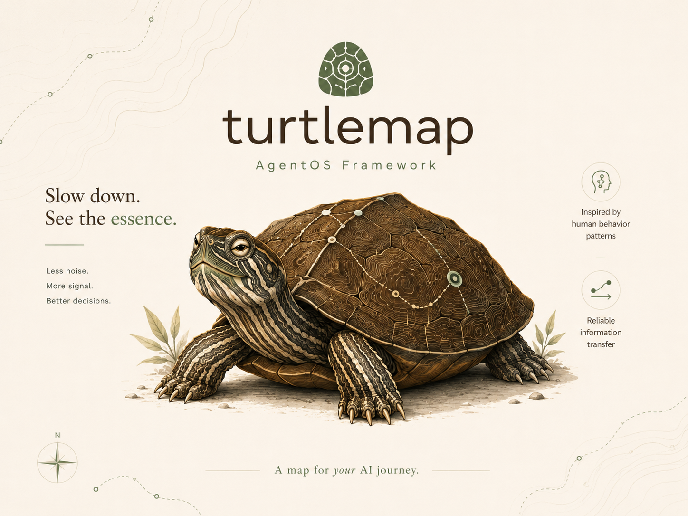
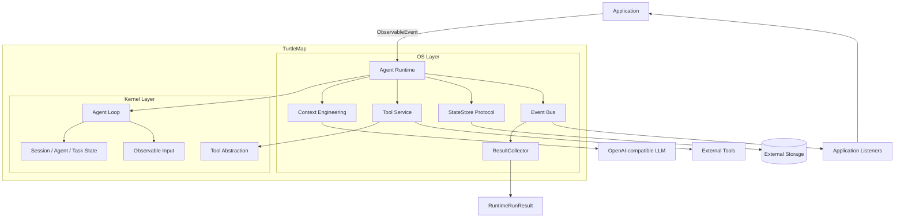
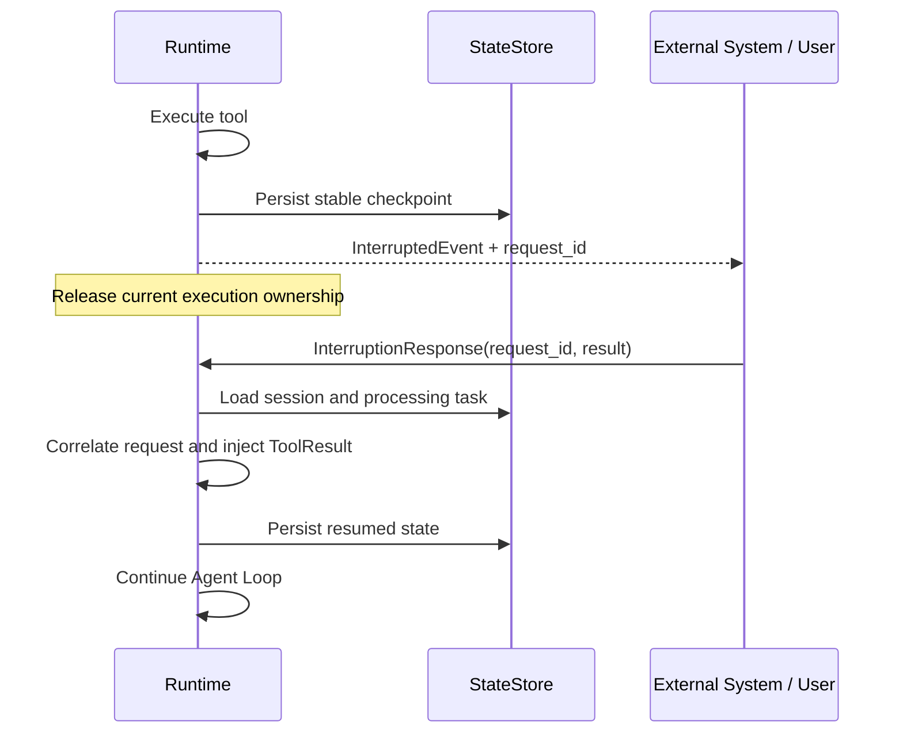

<p align="center">
  
</p>

<h1 align="center">TurtleMap</h1>

<p align="center">
  A microkernel-style Agent Runtime for stateful, resumable and observable agent execution.
</p>

<p align="center">
  面向服务端Agent应用的微内核运行时，重点解决状态管理、可恢复执行、上下文治理与运行事件分发。
</p>

## 运行演示


## 项目定位

许多Agent SDK能够完成模型调用、Tool Calling和基础Agent Loop，但进入真实服务后，开发者仍需要处理一组更困难的问题：

- 会话、Agent和当前任务状态由谁维护；
- 进程或请求结束后，如何保存并恢复未完成的执行现场；
- 审批、后台任务等外部结果如何回到原任务并继续执行；
- 长对话如何控制Token预算，同时避免后台压缩覆盖新消息；
- Runtime事件如何与最终结果解耦，并由不同调用方按需消费；
- 外部输入、工具结果和恢复响应如何统一进入Runtime，而不把业务协议带入内核。

TurtleMap将Agent理解为一个持续接收输入、维护状态、执行动作、挂起和恢复的运行系统，而不只是一次Prompt与Tool Calling。项目采用`kernel + os`微内核分层：`kernel`保留稳定的运行原语，`os`负责状态持久化、上下文治理、事件分发及服务化能力。

## 核心能力

| 能力 | 说明 |
| --- | --- |
| Agent Loop | 组织输入接收、上下文构建、模型推理、工具执行和状态推进 |
| 服务端状态管理 | 分层维护Session State、Agent State和Processing Task，前端无需持有运行现场 |
| Checkpoint / Resume | 通过状态序列化与StateStore保存稳定执行现场，支持中断后恢复 |
| 可恢复异步Request/Response | 将HITL和后台任务回流统一抽象为任务挂起、响应关联与断点恢复 |
| Tool Execution | Tool Schema、参数校验、同步/异步调用、统一ToolResult和系统工具注入 |
| Human-in-the-loop | 根据工具元数据自动插入审批步骤，审批结果通过中断响应回流 |
| Context Engineering | Token Budget、同步/后台压缩、历史折叠与压缩结果一致性合并 |
| Agent Memory | 长期/中期记忆管理、历史压缩和模型上下文注入 |
| Event Bus / ResultCollector | 分发结构化Runtime事件，并从事件流聚合稳定运行结果 |
| StateStore扩展 | 默认提供内存实现，并通过协议支持MySQL等外部持久化方案 |

## 总体架构



### 分层边界

- `kernel`：提供Agent、输入、状态、工具与运行循环等最小稳定原语，不感知SSE、数据库和产品展示协议。
- `os`：在kernel之上实现Context Engineering、状态持久化、Tool治理、事件总线和中断恢复。
- `examples`：展示如何在SDK边界之外接入数据库、HTTP服务和Web界面，业务协议不反向侵入Runtime。

## 关键设计

### 1. 服务端托管运行状态

TurtleMap不把聊天记录等同于完整运行状态，而是区分：

- `Session State`：当前会话的连续性状态；
- `Agent State`：不同Agent持有的System、Knowledge、History及Memory；
- `Processing Task`：仍在运行、等待外部结果或需要恢复的任务现场；
- `History`：面向后续模型上下文和产品展示的稳定历史，不保存半完成执行过程。

这种分层使Runtime能够在HTTP请求之外持续维护任务，并在新请求或新进程中重新加载状态。

### 2. 可恢复异步Request/Response

审批和后台任务看似是两类功能，在Runtime层都可以归一为“当前任务发出请求，等待未来某个响应”。



核心语义是：

```text
Task Suspend → Response Correlation → Resume
```

任务等待外部结果时保存执行上下文并释放当前执行权；响应返回后通过`task_id / request_id`定位挂起任务，将结果注入原工具执行链并从稳定断点继续运行。

### 3. Context Engineering与Memory

TurtleMap通过Token Budget控制模型上下文，在不同阈值下选择同步压缩或后台压缩：

- 硬限制触发同步压缩，保证当前请求不会超过模型上下文窗口；
- 软限制触发后台压缩，不阻塞当前回复；
- 后台压缩基于消息快照执行，写回时检查状态分支，避免覆盖压缩期间新增的消息；
- 长期与中期记忆由StateStore加载，并在构建上下文时注入模型；
- 工具不可用或工具结果过期时折叠历史工具链，避免旧事实继续影响当前推理。

### 4. Runtime事件与稳定结果解耦

Runtime执行过程中发布结构化`RuntimeEvent`，调用结束时返回由稳定事件聚合形成的`RuntimeRunResult`：

```text
Runtime
  └─ Event Bus
      ├─ ResultCollector → RuntimeRunResult
      └─ Application Listeners → logging / tracing / transport / UI
```

- Event Bus按运行通道分发输入、模型流、工具调用、工具结果、上下文压缩和中断事件；
- 同一逻辑事件使用稳定`event_id`，通过`parent_event_id`表达父子关系，并以生命周期阶段描述开始、过程和结束；
- ResultCollector只是普通监听者，负责把已闭合事件链聚合为稳定结果；
- 日志、Tracing、网络传输和产品展示由应用层监听者自行实现，不进入Runtime核心；
- Runtime不依赖某一种HTTP、SSE或消息队列协议。

### 5. Tool Execution与HITL

Tool层将身份、能力描述、输入Schema、执行策略和风险信息统一建模。Runtime支持同步工具与异步工具，并可根据`requires_confirmation`在真实工具执行前自动插入HITL审批步骤。

审批本身不需要独立的特殊调度器：它和后台任务一样，通过异步Request/Response进入挂起状态，待外部结果回流后继续原Tool Loop。

## 集成示例

`examples/`和`web/`提供React + FastAPI全栈示例，用于验证SDK能力如何被业务服务承接。以下内容属于示例应用，而不是TurtleMap Runtime的内置依赖：

- 多会话创建、历史查询与软删除；
- LLM流式输出、工具调用和运行状态展示；
- HITL审批与异步响应回流；
- MySQL持久化Session State和稳定消息投影；
- Redis Stream缓存运行事件；
- 网络断开后继续生成，页面重新进入后恢复事件流；
- `event_id / parent_event_id / task_id / sequence`结构化运行事件。

示例服务中的SSE协议、Redis Stream缓存、页面恢复和MySQL业务表均可被替换；TurtleMap只提供Runtime事件、状态与扩展协议。

## 快速开始

### 环境要求

- Python 3.10+
- Node.js 20+
- MySQL 8+
- Redis 6+
- 一个OpenAI兼容的模型服务

### 1. 安装Python依赖

```bash
python -m venv .venv
source .venv/bin/activate
pip install -e .
pip install fastapi uvicorn redis rich pytest
```

### 2. 准备MySQL

```sql
CREATE DATABASE turtlemap CHARACTER SET utf8mb4 COLLATE utf8mb4_unicode_ci;
```

示例服务启动时会按顺序执行`examples/mysql_store/migrations/`中的迁移脚本。

### 3. 配置环境变量

在仓库根目录创建`.env`：

```dotenv
TURTLEMAP_LLM_MODEL=your-model
TURTLEMAP_LLM_API_KEY=your-api-key
TURTLEMAP_LLM_BASE_URL=http://localhost:8001/v1
TURTLEMAP_LLM_TIMEOUT=120

TURTLEMAP_MYSQL_HOST=127.0.0.1
TURTLEMAP_MYSQL_PORT=3306
TURTLEMAP_MYSQL_USER=root
TURTLEMAP_MYSQL_PASSWORD=your-password
TURTLEMAP_MYSQL_DATABASE=turtlemap

TURTLEMAP_REDIS_HOST=127.0.0.1
TURTLEMAP_REDIS_PORT=6379
```

### 4. 启动服务端

```bash
python examples/main.py
```

服务端默认监听`http://localhost:8000`。

### 5. 启动Web演示

```bash
cd web
npm install
cp .env.example .env
npm run dev
```

浏览器访问`http://localhost:5173`。

### 6. 运行测试

```bash
pytest -q
```

## 项目结构

```text
turtlemap/
├── src/turtlemap/
│   ├── kernel/              # 最小运行原语与Agent Loop
│   ├── os/                  # 状态、Context、Tool、事件与恢复能力
│   └── shared/              # 公共异常、ID、Schema与工具函数
├── examples/
│   ├── mysql_store/         # MySQL StateStore及迁移示例
│   ├── server/              # 服务编排、SSE投影与Redis Stream
│   └── main.py              # FastAPI示例入口
├── web/                     # React演示界面
├── tests/                   # Runtime、状态、Context和事件相关测试
└── docs/架构设计/           # 详细架构与数据结构设计
```

## 设计文档

- [基本架构](./docs/架构设计/基本架构.md)
- [Kernel设计](./docs/架构设计/Kernel设计.md)
- [Runtime状态流转](./docs/架构设计/Runtime状态流转设计.md)
- [StateStore持久化](./docs/架构设计/StateStore持久化设计.md)
- [任务中断与恢复](./docs/架构设计/任务中断与恢复设计.md)
- [Context构建与Token预算](./docs/架构设计/Context构建与Token预算设计.md)
- [后台压缩任务](./docs/架构设计/后台压缩任务设计.md)
- [Runtime输出与事件总线](./docs/架构设计/Runtime输出与事件总线设计.md)

## 当前边界与Roadmap

当前已经完成单Agent Runtime、状态持久化、上下文治理、异步任务回流、HITL、事件分发和全栈服务演示。以下能力仍在演进中：

- 完整Handoff执行链路及子Agent回切；
- Planning与长任务分解；
- Multi-Agent编排与协作策略；
- MCP及Agent Skills原生适配；
- 分布式事件传输、执行调度与大规模运行验证；
- 稳定公共API、版本兼容策略和正式发布流程。

TurtleMap当前不是一个低代码Workflow平台，也不以堆叠Agent模式为目标。项目会继续围绕服务端状态、可靠信息传递、可恢复任务现场和长期运行能力演进。
