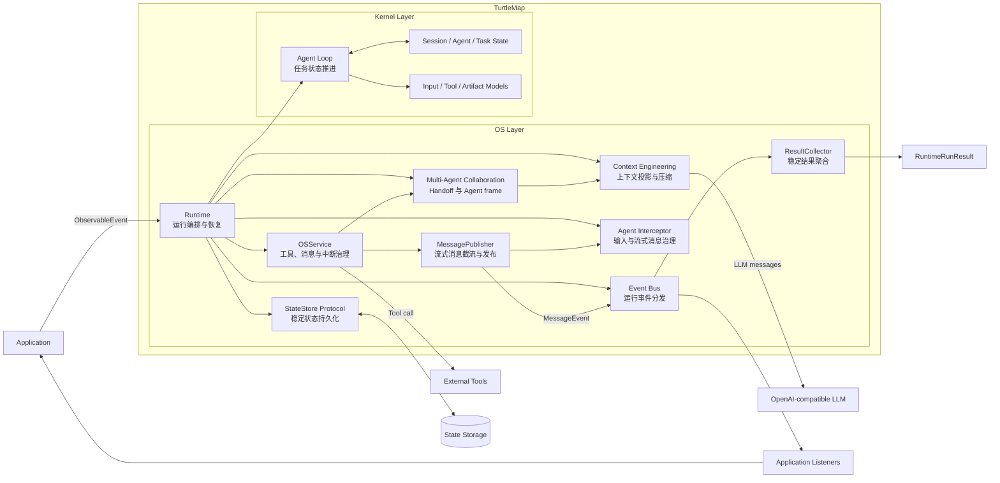
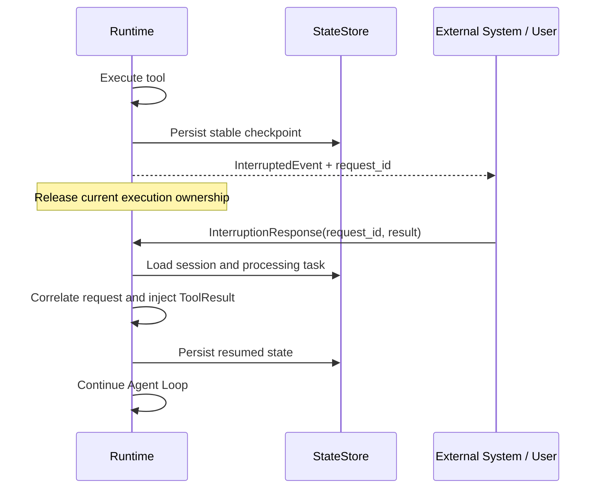

<p align="center">
  
</p>

<h1 align="center">TurtleMap</h1>

<p align="center">
  A microkernel-style Agent Runtime for stateful, resumable and observable agent execution.
</p>

<p align="center">
  面向服务端Agent应用的微内核运行时，重点解决状态管理、可恢复执行、上下文治理与运行事件分发。
</p>

## 运行演示


## 项目定位

TurtleMap 是面向服务端长期运行场景的 Agent Runtime SDK。它以真实工程问题为设计起点：让 Agent 可靠接收信息、保留未完成任务现场，并在请求结束、进程重启或外部结果返回后持续推进和恢复任务。模型、工具、状态与事件相关的设计都服务于这一目标，而不是为抽象本身增加概念。

许多Agent SDK能够完成模型调用、Tool Calling和基础Agent Loop，但真实服务还需要处理一组运行时问题：

- 会话、Agent和当前任务状态由谁维护；
- 进程或请求结束后，如何保存并恢复未完成的执行现场；
- 审批、后台任务等外部结果如何回到原任务并继续执行；
- 长对话如何控制Token预算，同时避免后台压缩覆盖新消息；
- 多 Agent 如何共享一份会话语义，同时维持各自的工具协议与角色边界；
- handoff 后由谁接收下一次输入、何时返回父 Agent，以及这些控制权变更如何稳定持久化；
- Runtime事件如何与最终结果解耦，并由不同调用方按需消费；
- 流式输出如何在不改造业务传输层的前提下完成截流、内容修订和覆盖重放；
- 外部输入、工具结果和恢复响应如何统一进入Runtime，而不把业务协议带入内核。

Agent 是一个持续接收输入、维护状态、执行动作、挂起和恢复的运行系统，而不只是一次 Prompt 与 Tool Calling。`Runtime` 组织输入、状态、上下文、工具调用与恢复流程：外部信息归一为事件，未完成工作保留为任务现场，后续执行从一致的状态继续推进。

项目采用`kernel + os`微内核分层：`kernel`保留输入、状态、工具、上下文和单Agent循环等稳定运行原语；`os`承接状态持久化、上下文治理、事件分发及服务化能力。LLM Client、知识检索、工具实现、HTTP协议和产品交互由应用按场景接入，并通过稳定边界与Runtime协作。

## 设计哲学

TurtleMap围绕以下原则演进：

- 技术设计服务于真实问题，而不是概念堆砌；
- 向人类处理事务的行为模式学习；
- 以`Runtime`为组织核心，使模型、工具、状态与外部事件在统一运行语义下协作；
- 可靠传达信息，区分事实、上下文、执行过程与面向用户的最终结果；
- 面向长期运行任务，保留可恢复的任务现场，而非只保存一次调用的文本结果。

## 核心能力

| 能力 | 说明 |
| --- | --- |
| Agent Loop | 组织输入接收、上下文构建、模型推理、工具执行和状态推进 |
| 服务端状态管理 | 分层维护Session State、Agent State和Processing Task，前端无需持有运行现场 |
| Checkpoint / Resume | 通过状态序列化与StateStore保存稳定执行现场，支持中断后恢复 |
| 可恢复异步Request/Response | 将HITL和后台任务回流统一抽象为任务挂起、响应关联与断点恢复 |
| Tool Execution | Tool Schema、参数校验、同步/异步调用、统一ToolResult和系统工具注入 |
| Human-in-the-loop | 根据工具元数据自动插入审批步骤，审批结果通过中断响应回流 |
| Context Engineering | Token Budget、同步/后台压缩、历史折叠与压缩结果一致性合并 |
| 会话级多 Agent | 共享会话 history/memory，按 Agent 视角投影上下文，支持 Group Input 与 handoff 控制权转移 |
| Handoff | 将目标 Agent 暴露为控制权转移工具，支持 frame push/pop、原始输入重入队与基于继续标记的自动返回 |
| Agent Memory | 长期/中期记忆管理、历史压缩和模型上下文注入 |
| Event Bus / ResultCollector | 分发结构化Runtime事件，并从事件流聚合稳定运行结果 |
| Agent Interceptor | 为输入与流式消息提供 AOP 扩展；支持截流、双通道内容修订、控制参数和 `IN_PROGRESS_PARTIAL` 覆盖重放 |
| StateStore扩展 | 默认提供内存实现，并通过协议支持MySQL等外部持久化方案 |

## 总体架构


```mermaid
flowchart LR
    Application[Application] -->|ObservableEvent| Runtime

    subgraph TurtleMap
        direction LR

        subgraph OS[OS Layer]
            direction TB
            Runtime[Runtime<br/>运行编排与恢复]
            Context[Context Engineering<br/>上下文投影与压缩]
            Collaboration[Multi-Agent Collaboration<br/>Handoff 与 Agent frame]
            Service[OSService<br/>工具、消息与中断治理]
            Interceptor[Agent Interceptor<br/>输入与流式消息治理]
            Publisher[MessagePublisher<br/>流式消息截流与发布]
            Store[StateStore Protocol<br/>稳定状态持久化]
            Bus[Event Bus<br/>运行事件分发]
            Collector[ResultCollector<br/>稳定结果聚合]
        end

        subgraph Kernel[Kernel Layer]
            direction TB
            Loop[Agent Loop<br/>任务状态推进]
            State[Session / Agent / Task State]
            Model[Input / Tool / Artifact Models]
        end
    end

    Runtime --> Loop
    Runtime --> Context
    Runtime --> Collaboration
    Runtime --> Service
    Runtime --> Interceptor
    Runtime --> Store
    Runtime --> Bus
    Loop <--> State
    Loop --> Model
    Collaboration --> Context
    Context -->|LLM messages| LLM[OpenAI-compatible LLM]
    Service --> Publisher
    Service --> Collaboration
    Publisher --> Interceptor
    Service -->|Tool call| Tools[External Tools]
    Publisher -->|MessageEvent| Bus
    Store <--> Storage[(State Storage)]
    Bus --> Collector
    Collector --> Result[RuntimeRunResult]
    Bus --> Listener[Application Listeners]
    Listener --> Application
```

### 分层边界

- `kernel`：提供Agent、输入、状态、工具与运行循环等最小稳定原语，不感知SSE、数据库和产品展示协议。
- `os`：在kernel之上实现Context Engineering、状态持久化、Tool治理、事件总线和中断恢复。
- `examples`：展示如何在SDK边界之外接入数据库、HTTP服务和Web界面，业务协议不反向侵入Runtime。

## 关键设计

### 1. 服务端托管运行状态

聊天记录并不等同于完整运行状态，运行时状态划分为：

- `Session State`：当前会话的连续性状态、共享 history、会话 memory、输入队列和 Agent frame 栈；
- `Agent State`：不同 Agent 的运行期任务集合及不可由会话历史推导的局部状态；
- `Agent Definition`：System、工具、handoff 图和能力边界等静态定义；
- `Processing Task`：仍在运行、等待外部结果或需要恢复的任务现场；
- `History`：面向后续模型上下文和产品展示的稳定历史，不保存半完成执行过程。

这种分层使Runtime能够在HTTP请求之外持续维护任务，并在新请求或新进程中重新加载状态。

### 2. 可恢复异步Request/Response

审批和后台任务看似是两类功能，在Runtime层都可以归一为“当前任务发出请求，等待未来某个响应”。


```mermaid
sequenceDiagram
    participant R as Runtime
    participant S as StateStore
    participant E as External System / User

    R->>R: Execute tool
    R->>S: Persist stable checkpoint
    R-->>E: InterruptedEvent + request_id
    Note over R: Release current execution ownership
    E->>R: InterruptionResponse(request_id, result)
    R->>S: Load session and processing task
    R->>R: Correlate request and inject ToolResult
    R->>S: Persist resumed state
    R->>R: Continue Agent Loop
```

核心语义是：

```text
Task Suspend → Response Correlation → Resume
```

任务等待外部结果时保存执行上下文并释放当前执行权；响应返回后通过`task_id / request_id`定位挂起任务，将结果注入原工具执行链并从稳定断点继续运行。

### 3. Context Engineering与Memory

TurtleMap通过Token Budget控制模型上下文，在不同阈值下选择同步压缩或后台压缩：

- 硬限制触发同步压缩，保证当前请求不会超过模型上下文窗口；
- 软限制触发后台压缩，不阻塞当前回复；
- 后台压缩基于消息快照执行，写回时检查状态分支，避免覆盖压缩期间新增的消息；
- 长期与中期记忆由StateStore加载，并在构建上下文时注入模型；
- 按当前 Agent、工具可用性和结果时效投影历史工具过程，避免旧工具协议或过期事实继续影响当前推理。

### 4. 会话级多 Agent 与Handoff

多 Agent 不维护彼此隔离的聊天副本。history 与 memory 归属于 Session，`RuntimeArtifact.owner_agent_name` 记录产物归属；上下文构建时，当前 Agent 自己的历史保持原生消息协议，其他 Agent 的连续历史作为 `Group Input` 注入当前任务上下文。

`handoff` 是控制权栈转移，而不是一次返回结果的工具调用：来源 Agent 调用 handoff 工具后，Runtime push 目标 Agent frame，并将原始输入以 handoff 来源重新入队。目标 Agent 在最终消息中声明继续标记时保留控制权；否则 Runtime pop 当前 frame，回到直接父 Agent。

这使多 Agent 会话既保持用户可感知的连续性，也不会把其他 Agent 的工具调用伪装成当前 Agent 的原生执行历史。

### 5. 流式消息治理

`MessagePublisher` 是 LLM 消息事件的统一发布入口。它按 `(event_id, choice_index)` 维护截流状态，并把模型原始内容、用户展示内容和后续 LLM 上下文内容分开处理：

- 原始 `content` 与 `reasoning_content` 保留模型输出事实；
- interceptor 可以分别修订 display/context 两条派生通道；
- 截流内容在释放前合并，`usage` 会强制结束截流，`END` 负责补发和清理；
- 已展示内容需要修订时，以同一 `event_id` 发布 `IN_PROGRESS_PARTIAL` 完整快照，由 collector 和展示层覆盖派生通道；
- 子 Agent 的 `<#CONTINUE#>` 控制标记可从展示通道移除，并以运行参数交给 Runtime 判断控制权是否返回。

这部分能力由 Runtime 持有，业务只需要实现 interceptor 策略，不需要理解流式缓冲、补发事件或 collector 聚合细节。

### 6. Runtime事件与稳定结果解耦

Runtime执行过程中发布结构化`RuntimeEvent`，调用结束时返回由稳定事件聚合形成的`RuntimeRunResult`：

```text
Runtime
  └─ Event Bus
      ├─ ResultCollector → RuntimeRunResult
      └─ Application Listeners → logging / tracing / transport / UI
```

- Event Bus按运行通道分发输入、模型流、工具调用、工具结果、上下文压缩和中断事件；
- 同一逻辑事件使用稳定`event_id`，通过`parent_event_id`表达父子关系，并以生命周期阶段描述开始、过程和结束；
- ResultCollector只是普通监听者，负责把已闭合事件链聚合为稳定结果；
- 日志、Tracing、网络传输和产品展示由应用层监听者自行实现，不进入Runtime核心；
- Runtime不依赖某一种HTTP、SSE或消息队列协议。

### 7. Tool Execution与HITL

Tool层将身份、能力描述、输入Schema、执行策略和风险信息统一建模。Runtime支持同步工具与异步工具，并可根据`requires_confirmation`在真实工具执行前自动插入HITL审批步骤。

审批本身不需要独立的特殊调度器：它和后台任务一样，通过异步Request/Response进入挂起状态，待外部结果回流后继续原Tool Loop。

## 集成示例

`examples/`和`web/`提供React + FastAPI全栈示例，用于验证SDK能力如何被业务服务承接。以下内容属于示例应用，而不是TurtleMap Runtime的内置依赖：

- 多会话创建、历史查询与软删除；
- LLM流式输出、工具调用和运行状态展示；
- HITL审批与异步响应回流；
- MySQL持久化Session State和稳定消息投影；
- Redis Stream缓存运行事件；
- 网络断开后继续生成，页面重新进入后恢复事件流；
- `event_id / parent_event_id / task_id / sequence`结构化运行事件。

示例服务中的SSE协议、Redis Stream缓存、页面恢复和MySQL业务表均可被替换；TurtleMap只提供Runtime事件、状态与扩展协议。

## 快速开始

### 环境要求

- Python 3.10+
- Node.js 20+
- MySQL 8+
- Redis 6+
- 一个OpenAI兼容的模型服务

### 1. 安装Python依赖

```bash
python -m venv .venv
source .venv/bin/activate
pip install -e .
pip install fastapi uvicorn redis rich pytest
```

### 2. 准备MySQL

```sql
CREATE DATABASE turtlemap CHARACTER SET utf8mb4 COLLATE utf8mb4_unicode_ci;
```

示例服务启动时会按顺序执行`examples/mysql_store/migrations/`中的迁移脚本。

### 3. 配置环境变量

在仓库根目录创建`.env`：

```dotenv
TURTLEMAP_LLM_MODEL=your-model
TURTLEMAP_LLM_API_KEY=your-api-key
TURTLEMAP_LLM_BASE_URL=http://localhost:8001/v1
TURTLEMAP_LLM_TIMEOUT=120

TURTLEMAP_MYSQL_HOST=127.0.0.1
TURTLEMAP_MYSQL_PORT=3306
TURTLEMAP_MYSQL_USER=root
TURTLEMAP_MYSQL_PASSWORD=your-password
TURTLEMAP_MYSQL_DATABASE=turtlemap

TURTLEMAP_REDIS_HOST=127.0.0.1
TURTLEMAP_REDIS_PORT=6379
```

### 4. 启动服务端

```bash
python examples/main.py
```

服务端默认监听`http://localhost:8000`。

### 5. 启动Web演示

```bash
cd web
npm install
cp .env.example .env
npm run dev
```

浏览器访问`http://localhost:5173`。

### 6. 运行测试

```bash
pytest -q
```

## 项目结构

```text
turtlemap/
├── src/turtlemap/
│   ├── kernel/              # 最小运行原语与Agent Loop
│   ├── os/                  # 状态、Context、Tool、事件与恢复能力
│   └── shared/              # 公共异常、ID、Schema与工具函数
├── examples/
│   ├── mysql_store/         # MySQL StateStore及迁移示例
│   ├── server/              # 服务编排、SSE投影与Redis Stream
│   └── main.py              # FastAPI示例入口
├── web/                     # React演示界面
├── tests/                   # Runtime、状态、Context和事件相关测试
└── docs/架构设计/           # 详细架构与数据结构设计
```

## 设计文档

### 基础与Kernel

- [基本架构](./docs/架构设计/0_基本架构.md)
- [Kernel设计](./docs/架构设计/1.0_Kernel设计.md)
- [Kernel原型接口](./docs/架构设计/1.1_Kernel原型接口设计.md)
- [Kernel数据结构](./docs/架构设计/1.2_Kernel数据结构设计.md)

### Runtime与上下文

- [Runtime状态流转](./docs/架构设计/2.0_Runtime状态流转设计.md)
- [Runtime前置流程](./docs/架构设计/2.1_Runtime前置流程设计.md)
- [Runtime输出与事件总线](./docs/架构设计/2.2_Runtime输出与事件总线设计.md)
- [Context构建与Token预算](./docs/架构设计/3.0_Context构建与Token预算设计.md)
- [后台压缩任务](./docs/架构设计/3.1_后台压缩任务设计.md)
- [Task Context Engineering](./docs/架构设计/3.2_Task%20Context%20Engineering设计.md)
- [任务中断与恢复](./docs/架构设计/4.0_任务中断与恢复设计.md)

### 多Agent与运行期扩展

- [Handoff控制权转移](./docs/架构设计/5.0_Handoff控制权转移设计.md)
- [会话级上下文与多Agent协作](./docs/架构设计/5.1_会话级上下文与多Agent协作设计.md)
- [Agent运行期拦截机制](./docs/架构设计/5.2_Agent运行期拦截机制设计.md)

### 状态与持久化

- [History版本管理](./docs/架构设计/6.0_History版本管理设计.md)
- [Observation最小设计](./docs/架构设计/6.1_Observation最小设计.md)
- [StateStore持久化](./docs/架构设计/6.2_StateStore持久化设计.md)

## 当前边界与Roadmap

当前已经完成状态持久化、上下文治理、异步任务回流、HITL、会话级多 Agent、handoff 控制权转移、流式消息截流与覆盖重放，以及全栈服务演示。以下能力仍在演进中：

- 与任务无关的显式 takeover，以及更丰富的多 Agent 协作策略；
- Planning、Resolve 与长任务分解；
- Agent Skills、Shell 等面向执行能力的原生抽象；
- MCP 适配、分布式事件传输、执行调度与大规模运行验证；
- 稳定公共 API、版本兼容策略和正式发布流程。

TurtleMap不是低代码 Workflow 平台，也不以堆叠 Agent 模式为目标。后续仍将围绕服务端状态、可靠信息传递、会话级上下文、可恢复任务现场和长期运行能力演进。
